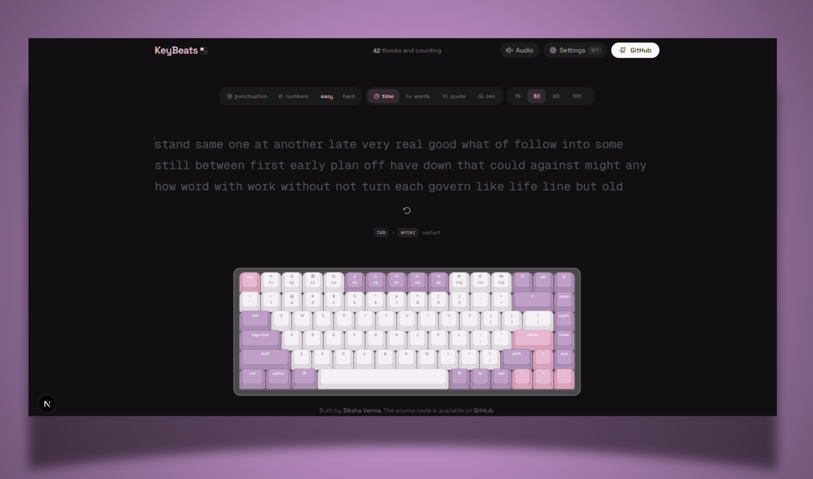

<a name="readme-top"></a>



<p align="center">
  <h3 align="center">KeyBeats</h3>
  <p align="center">
    A free typing test with realistic mechanical keyboard sounds
    
  </p>
</p>


<details>
<summary>Table of Contents</summary>

- [About](#about)
- [Features](#-features)
- [Tech Stack](#-tech-stack)
- [Getting Started](#-getting-started)
- [Scripts](#-scripts)
- [Contributing](#-contributing)
- [Follow Me](#-follow-me)
- [Deployment](#-deployment)
- [Give A Star](#-give-a-star)
- [Star History](#-star-history)


</details>

## About

**KeyBeats** is a free online typing test with **realistic mechanical keyboard sounds** and real-time WPM tracking. Practice with timed tests, word counts, quotes, or zen mode — featuring an interactive on-screen keyboard, satisfying key sounds, and detailed accuracy stats.

## ✨ Features

| Area | What you get |
|------|----------------|
| **Test modes** | Time (15s–120s), word count, quotes (length presets), zen |
| **Mechanical key sounds** | Realistic per-key audio feedback via Web Audio; multiple keyboard themes |
| **Virtual keyboard** | Interactive on-screen keyboard that highlights keys as you type (desktop) |
| **Results** | WPM, raw speed, accuracy, character breakdown, consistency, elapsed time, WPM-over-time chart |
| **Keyboard themes** | 6 color schemes — Classic, Mint, Royal, Dolch, Sand, Scarlet — each tints the entire UI |
| **Typing fonts** | 9 fonts — Geist Mono, JetBrains Mono, Fira Code, IBM Plex Mono, Source Code Pro, Inter Tight, Space Grotesk, Nunito, Atkinson Hyperlegible |
| **Settings** | Theme (light/dark/system), accent color, font picker, show keyboard, sound volume, live WPM, ghost mode |
| **Haptics** | Optional vibration on supported hardware |

Settings persist in `localStorage`.

## 🛠 Tech Stack

<details><summary><b>KeyBeats</b> is built using the following technologies:</summary>

- [TypeScript](https://www.typescriptlang.org/): Typed superset of JavaScript.
- [Next.js](https://nextjs.org/) 16: React framework with App Router.
- [React](https://react.dev/) 19: UI library.
- [Tailwind CSS](https://tailwindcss.com/): Utility-first CSS framework.
- [Base UI](https://base-ui.com/): Unstyled, accessible component primitives from MUI.
- [shadcn/ui](https://ui.shadcn.com/): Pre-styled component recipes.
- [Motion](https://motion.dev/): Animation library for React.
- [Recharts](https://recharts.org/): Composable charting library.
- [Drizzle ORM](https://orm.drizzle.team/) + LibSQL: Type-safe database layer.
- [Biome](https://biomejs.dev/): Fast linter and formatter.
- [Serwist](https://serwist.pages.dev/): PWA / service worker toolkit.
- [Vercel](https://vercel.com/): Deployment platform.

</details><br/>

[]

## 🧰 Getting Started

1. Make sure [Git](https://git-scm.com/downloads) and [Bun](https://bun.sh/) (or Node.js 20+) are installed.
2. Fork this repository and clone **your fork**:

   ```bash
   git clone https://github.com/<your-username>/keybeats.git
   cd keybeats
   ```

3. Install dependencies and start the dev server:

   ```bash
   bun install
   bun dev
   ```

4. Open [http://localhost:3000](http://localhost:3000) in your browser.

## 📜 Scripts

| Command | Description |
|--------|-------------|
| `bun dev` | Development server |
| `bun run build` | Optimized production build |
| `bun start` | Serve the production build |
| `bun run lint` | Lint with Biome |
| `bun run lint:fix` | Lint and auto-fix with Biome |
| `bun run format` | Format with Biome |
| `bun run typecheck` | Type-check with TypeScript |

**greatly appreciated**.

1. Fork the repo
2. Create a new branch (`git checkout -b improve-feature`)
3. Make the appropriate changes in the files
4. Commit your changes (`git commit -am 'Improve feature'`)
5. Push to the branch (`git push origin improve-feature`)
6. Create a Pull Request


## ⭐ Give A Star

If you found this project useful, give it a star to help more people discover it!

